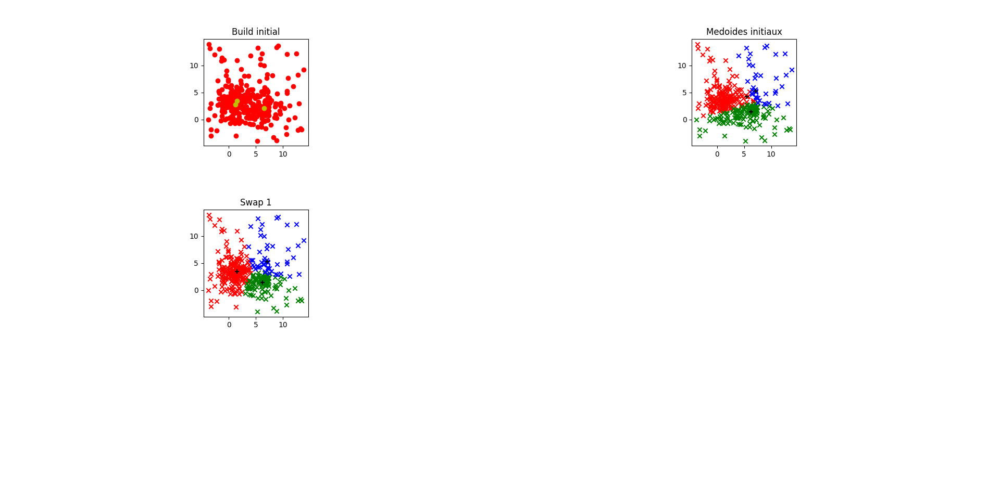
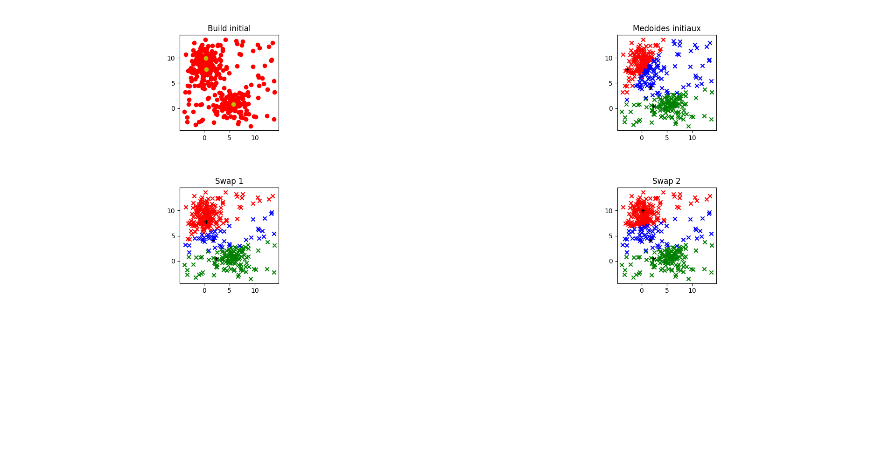

= Apprentissage non supervisé
:stem: latexmath

L'apprentissage non supervisé est une branche de l'apprentissage automatique qui vise à découvrir des structures et des modèles cachés dans les données sans l'aide d'étiquettes ou de réponses préexistantes. Contrairement à l'apprentissage supervisé, où les données sont étiquetées, l'apprentissage non supervisé explore les données pour trouver des schémas et des relations intrinsèques.

L'un des algorithmes les plus couramment utilisés en apprentissage non supervisé est l'algorithme des k-médoides.

== L'algorithme des k-médoides

L'algorithme des k-médoides est une méthode de clustering qui vise à partitionner un ensemble de données non catégorisé en k groupes distincts. Il est basé sur la notion de médoides, qui sont des points de données représentatifs de chaque catégorie.

L'algorithme des k-médoides fonctionne de la manière suivante :

1. Sélectionner aléatoirement k points de données comme médoides initiaux.
2. Assigner chaque point de données au médoide le plus proche.
3. Pour chaque groupe, calculer le médioide en remplaçant le médioide actuel par le point de données qui minimise la somme des distances aux autres points du groupe.
4. Répéter les étapes 2 et 3 jusqu'à ce que les médoides convergent.

L'algorithme des k-médoides est largement utilisé dans divers domaines, tels que la segmentation d'images, l'analyse de données et la recommandation de produits.

La fonction de coût associée à l'algorithme des k-médoides est généralement définie comme la somme des distances entre chaque point d'un cluster et son médoid. Plus formellement, si nous définissons latexmath:[C] comme l'ensemble des clusters, latexmath:[m_i] comme le médoide du cluster latexmath:[C_i] , et latexmath:[d(x,y)] comme la distance entre les points latexmath:[x] et latexmath:[y], alors la fonction de coût latexmath:[J] peut être définie comme suit :

latexmath:[J = \sum_{i=1}^{k} \sum_{x \in C_i} d(x, m_i)]

L'objectif de l'algorithme est de trouver une partition des données qui minimise cette fonction de coût. Cependant, le problème est NP-difficile, ce qui signifie qu'il n'existe pas d'algorithme efficace pour trouver la solution optimale en temps polynomial. Par conséquent, l'algorithme des k-médoides utilise une approche itérative pour converger vers une solution satisfaisante en ajustant les médoids et en réassignant les points aux clusters. +
Ainsi, la complexité de l'algorithme des k-médoides est de l'ordre de latexmath:[O(n^{2}kt)] où latexmath:[n] est le nombre de points de données, latexmath:[k] est le nombre de clusters, et latexmath:[t] est le nombre d'itérations nécessaires pour converger.

== L'algorithmes des k-médoides en Python

Contrairement à notre démonstration de l'algorithme des KNN, nous n'avons pas de données étiquetées pour l'apprentissage non supervisé. Nous allons donc générer nous même des données pour notre démonstration.

Comme l'algorihme des k-médoides est un algorithme de clustering, il nous faut des données circulaires. Nous allons donc utiliser les librairies random et math pour générer des données aléatoires à l'aide de la fonction sin() et cos(). Nous allons ensuite utiliser la librairie matplotlib pour visualiser nos données.

On va commencer par initialiser les variables dont nous aurons besoin pour notre démonstration.

.main.py
[source,python]
----
nb_points = 400
nb_centres = 3
nb_points_random = int(nb_points // 5)  # On rajoutera 1/5 des points totaux en points completement aleatoires
offset = 2  # On définit un décalage des points par rapport à leur centre
subplots_counter = 2
subplots_row_pointer = 1
subplots_col_pointer = False
----

Ensuite on génère les coordonnées des centres de nos clusters puis on génère les coordonnées des points de nos clusters. On va également générer quelques points aléatoires pour essayer d'avoir un jeu de données un peu plus hétérogène. Les points seront compris entre 0 et 10 pour les centres et entre 0 - offset et 10 + offset pour les points. +
On place ces points sur un premier subplot.

.main.py
[source,python]
----
# On choisit les medoides initiaux
for ixe in range(nb_centres):
    coordonnees_point = (random.random() * 10, random.random() * 10)
    centres.append(coordonnees_point)
    points.append(coordonnees_point)

# On place les points autour des centres en calculant un décalage circulaire
for ixe in range(nb_points):
    a = random.random() * math.pi * 2
    r = (random.random() * offset) ** 2
    x = math.cos(a) * r
    y = math.sin(a) * r
    centre_choisi = centres[random.randint(0, len(centres) - 1)]
    ax1.scatter(centre_choisi[0] + x, centre_choisi[1] + y, color='r')
    points.append((centre_choisi[0] + x, centre_choisi[1] + y))

# On place quelques points complètement aléatoires
for ixe in range(nb_points_random):
    x = random.random() * (10 + ((offset ** 2) * 2)) - offset ** 2
    y = random.random() * (10 + ((offset ** 2) * 2)) - offset ** 2
    ax1.scatter(x=x, y=y, color='r')
    points.append((x, y))

# On place les centres
for centre_actuel in centres:
    ax1.scatter(centre_actuel[0], centre_actuel[1], color='y')
----

Maintenant qu'on a nos données, on va pouvoir implémenter l'algorithme des k-médoides.
On choisit aléatoirement k points de données comme médoides initiaux. 

.main.py
[source,python]
----
for ixe in range(nb_centres):
    medoides.append(points[random.randint(0, len(points) - 1)])
----

On va calculer la distance entre chaque point et chaque centre et on va assigner chaque point à son centre le plus proche. 

.main.py
[source,python]
----
distances_medoides = {}
for coordonnees_point in points:
    distances_point_to_centres = []
    medoide = []
    for centre_actuel in medoides:
        distances_point_to_centres.append(math.dist([coordonnees_point[0], coordonnees_point[1]], centre_actuel))
        medoide.append(centre_actuel)

    min_distance = min(distances_point_to_centres)
    if not distances_medoides.get(str(medoide[distances_point_to_centres.index(min_distance)])):
        distances_medoides[str(medoide[distances_point_to_centres.index(min_distance)])] = [
            [[coordonnees_point[0], coordonnees_point[1]], min_distance]]
    else:
        distances_medoides[str(medoide[distances_point_to_centres.index(min_distance)])].append(
            [[coordonnees_point[0], coordonnees_point[1]], min_distance])
----

On place ensuite les points dans les clusters correspondants sur un nouveau subplot.

.main.py
[source,python]
----
couleur = ['r', 'g', 'b', 'c', 'm', 'y']
cles_dict = list(distances_medoides.keys())

for x in range(len(distances_medoides)):
    couleur_actuelle = couleur[x]
    for element in distances_medoides[cles_dict[x]]:
        ax2.scatter(element[0][0], element[0][1], color=couleur_actuelle, marker="x")

# On place les médoïdes en forme de croix pour bien les repérer
for x in medoides:
    ax2.scatter(x[0], x[1], color='#000', marker="+")
----

On va ensuite calculer le coût de configuration total pour plus tard ce qui revient à calculer la somme des distances entre chaque point et son centre.

.main.py
[source,python]
----
for element in distances_medoides.values():
    for co_point_et_distance in element:
        config_cost += co_point_et_distance[1]
----

On va maintenant essayer de réduire le coût de configuration en changeant les médoides. On va donc calculer le coût de configuration pour chaque point et chaque médoides et on va remplacer le médoides par le point qui minimise le coût de configuration. Si le coût de configuration est plus élevé, on ne change pas le médoides et on arrête l'algorithme.

.main.py
[source,python]
----
for x in range(len(medoides)-1, -1, -1):
    for o in points:
        # les medoides sont dans le tableau des points donc on ne va pas calculer le cout d'echange du medoide avec lui meme
        if medoides[x] == o:
            pass
        else:
            # copie profonde de medoides puisque l'on va modifier la liste
            medoides_copie = copy.deepcopy(medoides)
            # on supprime le medoide actuel
            medoides_copie.pop(x)
            # on ajoute le nouveau medoide
            medoides_copie.append(o)
            # calcul distances
            distances_medoides = {}  # Ce dictionnaire est de la forme clé = coordonnées d'un médoide et valeur = [[x, y], distance avec le medoide]
            for coordonnees_point in points:
                distances_point_to_centres = []
                medoide = []
                for centre_actuel in medoides_copie:
                    distances_point_to_centres.append(
                        math.dist([coordonnees_point[0], coordonnees_point[1]], centre_actuel))
                    medoide.append(centre_actuel)

                min_distance = min(distances_point_to_centres)
                if not distances_medoides.get(str(medoide[distances_point_to_centres.index(min_distance)])):
                    distances_medoides[str(medoide[distances_point_to_centres.index(min_distance)])] = [
                        [[coordonnees_point[0], coordonnees_point[1]], min_distance]]
                else:
                    distances_medoides[str(medoide[distances_point_to_centres.index(min_distance)])].append(
                        [[coordonnees_point[0], coordonnees_point[1]], min_distance])

            # calcul cout supposé
            for element in distances_medoides.values():
                for co_point_et_distance in element:
                    supposed_cost += co_point_et_distance[1]

            if supposed_cost < config_cost:
                # On supprime l'ancien médoide dans la liste itéré et on ajoute le nouveau
                medoides.pop(x)
                medoides.append(o)

                couleur = ['r', 'g', 'b', 'c', 'm', 'y']
                cles_dict = list(distances_medoides.keys())

                # Selection du subplot
                if subplots_col_pointer:
                    ax_current = axs[subplots_row_pointer, 1]
                    subplots_col_pointer = False
                    subplots_row_pointer += 1
                    subplots_counter += 1
                else:
                    ax_current = axs[subplots_row_pointer, 0]
                    subplots_col_pointer = True
                    subplots_counter += 1

                # On place les points selon leur médoïde
                for x in range(len(distances_medoides)):
                    couleur_actuelle = couleur[x]
                    for element in distances_medoides[cles_dict[x]]:
                        ax_current.scatter(element[0][0], element[0][1], color=couleur_actuelle, marker="x")

                # On place les médoïdes en forme de croix pour bien les repérer
                for z in medoides_copie:
                    ax_current.scatter(z[0], z[1], color='#000', marker="+")

                ax_current.set_title(f'Swap {subplots_counter-2}')
                ax_current.set_aspect(1)
                print(f'Cout de config supposé:{supposed_cost}')
                config_cost = supposed_cost  # On met à jour le cout de configuration
                supposed_cost = 0  # On remet à 0 le cout supposé
            else:
                # Le cout de configuration est plus grand que le cout supposé donc on arrête
                break
----

Une fois l'algorithme terminé, on affiche le résultat final. +
Résultats :

