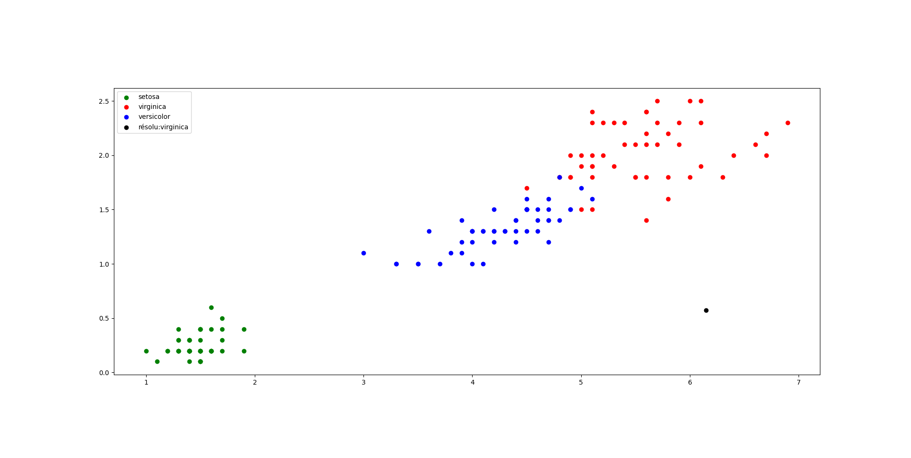

= Apprentissage supervisé

L'apprentissage supervisé est une branche du machine learning qui vise à entraîner un modèle à partir de données étiquetées. Dans ce type d'apprentissage, un ensemble de données est utilisé pour apprendre au modèle à effectuer des prédictions sur de nouvelles données.

L'objectif de l'apprentissage supervisé est de trouver une fonction qui peut mapper les caractéristiques d'entrée (variables indépendantes) aux catégories de sortie (variable dépendante). Cette fonction est ensuite utilisée pour prédire les catégories de sortie pour de nouvelles données.

L'apprentissage supervisé est largement utilisé dans de nombreux domaines, tels que la reconnaissance de formes, la classification d'images, la prédiction de valeurs numériques, etc. Il existe plusieurs algorithmes d'apprentissage supervisé, dont l'algorithme des k plus proches voisins (KNN) est l'un des plus populaires.

== L'algorithme des KNN

L'algorithme des k plus proches voisins (KNN) est une méthode d'apprentissage supervisé utilisée pour la classification et la régression. Il repose sur le principe que des points similaires ont tendance à se regrouper dans l'espace des caractéristiques.

L'idée principale derrière l'algorithme des KNN est de trouver les k échantillons les plus proches d'un nouvel échantillon et de prédire l'étiquette en fonction des étiquettes des échantillons voisins. Ici, on mesurera la proximité en utilisant la distance euclidienne même si on peut utiliser d'autres mesures de distance comme la distance de Manhattan.

L'algorithme des KNN est simple à comprendre et à mettre en œuvre, mais il peut être sensible à la présence de valeurs aberrantes et à la dimensionnalité élevée des données. Il est important de choisir judicieusement la valeur de k et de normaliser les caractéristiques pour obtenir de meilleurs résultats. 

Maintenant que l'algorithme est présenté, nous allons l'implémenter en Python.

== L'algorithme KNN en Python

Tout d'abord nous allons utiliser le dataset link:iris.csv[iris] qui est un dataset très connu et qui est disponible dans la librairie scikit-learn. Ce dataset contient 150 échantillons de fleurs de 3 espèces différentes (iris setosa, iris virginica et iris versicolor). Pour chaque échantillon, nous avons 4 caractéristiques (longueur et largeur du sépale et du pétale). + 
Également, nous utiliserons les librairies pandas pour charger les données du dataset, matplotlib pour visualiser les données, math pour calculer les distances et random pour générer un échantillon aléatoire.

Les échantillons utilisés seront la longueur du pétale en abscisse et la largeur du pétale en ordonnée. Les couleurs des points représentent les espèces de fleurs.

.main.py
[source, python]
----
iris = pandas.read_csv("iris.csv")
x = iris.loc[:, "petal_length"]
y = iris.loc[:, "petal_width"]
lab = iris.loc[:, "species"]
----

On calcule ensuite un échantillon aléatoire sans le faire dépasser des limites du graphique.

.main.py
[source, python]
----
k = 5
intrus_x = random.random() * 7 + .1
intrus_y = random.random() * 2.5 + .01
----

On calcule ensuite la distance euclidienne entre l'échantillon aléatoire et tous les autres échantillons du dataset. On stocke les distances dans une liste.

.main.py
[source, python]
----
distance_points = []
for i in range(len(x)):
   dist = math.dist([intrus_x, intrus_y], [x[i], y[i]])
   distance_points.append((dist, [x[i], y[i], lab[i]]))
----

Ensuite, on trie la liste des distances par ordre croissant. On garde les k premières distances.

.main.py
[source, python]
----
distance_points = sorted(distance_points)[:k]
----

On compte le nombre d'occurrences de chaque espèce dans les k premières distances. On choisit l'espèce majoritaire. On place l'échantillon aléatoire sur le graphique.

.main.py
[source, python]
----
majorite_types = {}
for ixe in distance_points:
   if ixe[1][2] not in majorite_types:
       majorite_types[ixe[1][2]] = 1
   else:
       majorite_types[ixe[1][2]] += 1
intrus_type = max(majorite_types, key=majorite_types.get)
ax.scatter(intrus_x, intrus_y, color='black', label=f'résolu:{intrus_type}')
----

Résultat :

.1er résultat

.2ème résultat
