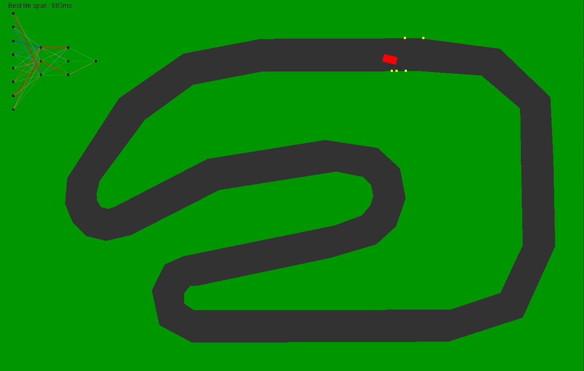
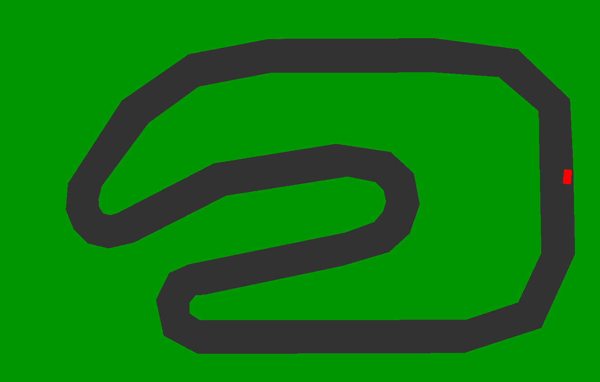

= Apprentissage par renforcement
:stem: latexmath

En intelligence artificielle, plus précisément en apprentissage automatique, l'apprentissage par renforcement consiste, pour un agent autonome (ex. : robot, agent conversationnel, personnage dans un jeu vidéo, etc.), à apprendre les actions à prendre, à partir d'expériences, de façon à optimiser une récompense quantitative au cours du temps. L'agent est plongé au sein d'un environnement et prend ses décisions en fonction de son état courant. En retour, l'environnement procure à l'agent une récompense, qui peut être positive ou négative. L'agent cherche, au travers d'expériences itérées, un comportement décisionnel optimal, en ce sens qu'il maximise la somme des récompenses au cours du temps.

== L'algorithme de la neuro-car

La neuro-car est une petite voiture qui apprend à conduire, elle est placée sur un circuit sans aucune informations. Elle commence avec un cerveau (réseau neuronal) aléatoire qui détermine sa conduite en fonction de ses capteurs (Elle detecte la route à l'aide de 7 vecteurs pointés dans des direction différentes). Si jamais elle sort du circuit, on la replace au départ, mais avant de la laisser repartir, deux options sont possible :

- Si elle a mieux réussi (a survécu plus longtemps) que la fois d'avant, son cerveau deviens son "meilleur cerveau" et on le sauvegarde. Ensuite on applique de légères mutations aléatoires dans l'espoir de l'améliorer.

- Si elle n'a pas fait mieux, cela veux dire que les mutations ont été infructueuses. L'on revient donc au "meilleur cerveau" suvegardé et l'on réapplique d'autre mutations.

En la laissant s'entrainer suffisamment, on la voit progresser et finir par faire un tour de circuit (Cela peut prendre très longtemps à cause de l'aléatoire des mutations).

== Capture d'écran et visuels

L'on peut voir en haut a gauche de l'écran le "cerveau" de la neuro-car avec la couleur représentant le poids des connexion entre neurones (bleu ~ -1, rouge ~ 1, transparent ~ 0).
L'on voit aussi le meilleur temps de survie de la neuro-car.
Et enfin les points jaunes indique la vue de la voiture, ce que voient ses capteurs.

